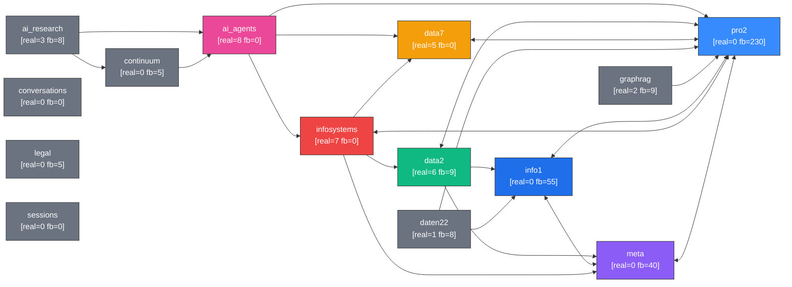

# ⬡ Nautilus Ecosystem Snapshot

*Generated: 2026-04-27T04:17:47Z*

**Score: 66/100** `[█████████████░░░░░░░]`

## Adapters

| Adapter | Entries (real) | Entries (fallback) | Q6 | Links |
|---------|---------------|-------------------|----|----|
| ✅ ai_agents | 1 | 0 | ✓ | 0ms |
| ✅ ai_research | 0 | 2 | ✓ | 0ms |
| ✅ continuum | 0 | 1 | ✓ | 0ms |
| ✅ conversations | 3 | 0 | ✓ | 6ms |
| ✅ data2 | 0 | 3 | ✓ | 0ms |
| ✅ data7 | 4 | 0 | ✓ | 0ms |
| ✅ daten22 | 1 | 0 | ✓ | 0ms |
| ✅ graphrag | 1 | 0 | ✓ | 0ms |
| ✅ info1 | 0 | 11 | ✓ | 32ms |
| ✅ infosystems | 3 | 0 | ✓ | 0ms |
| ✅ legal | 0 | 1 | ✓ | 0ms |
| ✅ meta | 0 | 8 | ✓ | 0ms |
| ✅ pro2 | 0 | 46 | ✓ | 0ms |
| ✅ sessions | 3 | 0 | ✓ | 6ms |

## Cross-Adapter Links (sample)

- `ai_agents:bidir_agent` → `data7:missing_loop` (ai_agents ↔ data7)
- `ai_agents:self_train` → `data7:theory:transformation` (ai_agents ↔ data7)
- `ai_agents:bidir_agent` → `infosystems:knowledge_graph` (ai_agents ↔ infosystems)
- `ai_agents:bidir_agent` → `pro2:bidir` (ai_agents ↔ pro2)
- `ai_agents:nautilus_hierarchy` → `pro2:nautilus` (ai_agents ↔ pro2)
- `ai_agents:nautilus_hierarchy` → `pro2:six_sources` (ai_agents ↔ pro2)
- `ai_agents:self_train` → `pro2:self_train` (ai_agents ↔ pro2)
- `ai_agents:generator` → `pro2:generate` (ai_agents ↔ pro2)
- `ai_agents:generator` → `pro2:speculative` (ai_agents ↔ pro2)
- `ai_agents:hmoe_curriculum` → `pro2:hmoe` (ai_agents ↔ pro2)
- `ai_agents:hmoe_curriculum` → `pro2:domain_routing` (ai_agents ↔ pro2)
- `ai_research:agentic_workflow` → `ai_agents:self_train` (ai_research ↔ ai_agents)
- `ai_research:mas` → `ai_agents:self_train` (ai_research ↔ ai_agents)
- `ai_research:agentic_workflow` → `continuum:dag` (ai_research ↔ continuum)
- `continuum:core` → `ai_agents:self_train` (continuum ↔ ai_agents)
- `continuum:step` → `daten22:planner` (continuum ↔ daten22)
- `data2:etd` → `info1:methodology` (data2 ↔ info1)
- `data2:three_spheres` → `info1:alpha:-1` (data2 ↔ info1)
- `data2:arch:синтез` → `info1:alpha:3` (data2 ↔ info1)
- `data2:vol:20` → `info1:alpha:0` (data2 ↔ info1)

## Issues

- ⚠️  Только fallback-записи: info1, pro2, meta, data2, legal, continuum, ai_research
- ❌ Паспорта отсутствуют: jsonl
- ⚠️  Неполные паспорта: ai_research
- ⚠️  Низкий консенсус: knowledge, синтез

## Ecosystem Graph

